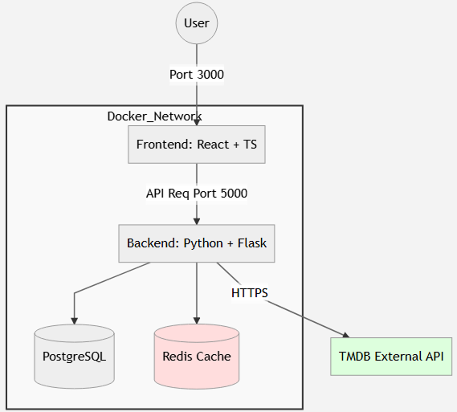
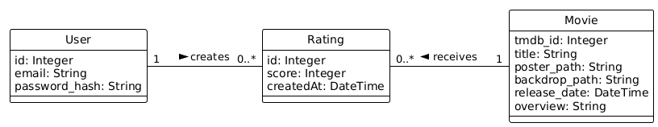
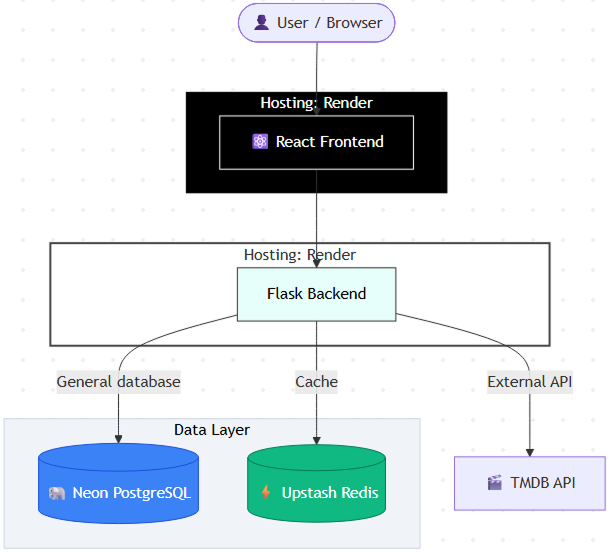

  

## Pixel Breeders - Movie Database Challenge

  

> Technical assessment for the Web Development Internship position at **Pixel Breeders**.

  

This project is a full-stack web application designed to allow users to search for movies via the TMDB API, view detailed information, and manage personal ratings. It leverages **Docker** for containerization, **Redis** for caching external API responses to improve performance, and **PostgreSQL** for persistent user data.

> The deployment of the app can be acessed in this link: https://pixelbreeders-12022026.onrender.com/  

---

  

### 🏗️ Infrastructure & Architecture

  

The application is fully containerized using Docker Compose. Below is the high-level architecture showing how the services communicate within the Docker network.

### 📋 Requirements

You must have Docker installed on your machine.

  

### 🚀 How to install & Run

The entire application (Frontend, Backend, Database, and Cache) can be launched with a single command. The entrypoint script automatically handles database migrations.

    docker-compose  up  --build

Access  the  application  at:  http://localhost:3000

### 🧪 How to test

To run the unit tests and check code coverage for the backend:

    docker-compose exec backend pytest --cov

> **Note on Coverage**: All core business logic and API routes have 100% unit test coverage. 
> The minor misses in `app.py` are related to the standard application factory boilerplate 
> and local debug execution blocks.

| Name | Stmts | Miss | Cover | Missing |
|--|--|--|--|--|
| **app.py** | 39 | 2 | 95% | 44, 52 |
| **models.py** | 37 | 0 | 100% | |
| **routes/auth.py** | 36 | 0 | 100% | |
| **routes/cast.py** | 23 | 0 | 100% | |
| **routes/genres.py** | 22 | 0 | 100% | |
| **routes/movies.py** | 35 | 0 | 100% | |
| **routes/review.py** | 75 | 0 | 100% | |
| **TOTAL** | **267** | **2** | **99%** | |

### 🗃️ Database Modelling

The database was designed to persist user ratings while minimizing redundancy.

Note: data was added to the Movie class (locally) so that it is not necessary to retrieve that data from external services (TMDB) every time the user views their rated list.

The composition of actors is not maintained in the local database, with the assumption that this data does not have intensive use for the local user context and can be fetched from the API/Cache when needed.

### 🚀 Deployment

### 📝 Implementation plan + requirements
**Basic setup**
-   [x] Technical Stack & Setup
-   [x] Frontend: React with TypeScript.
-   [x] Backend: Python with Flask.
-   [x] Database: PostgreSQL.
-   [x] External API
-   [x] Test using Postman
    -   [x] The Movie Database (TMDB).
    -   [x] The final API.
-   [x] Database modeling.

**Main Page**
-   [x] Search bar: Search on TMDB public API.
-   [x] Results list: Display of found movies.
-   [x] Loading states: Visual feedback during search.
-   [x] Interaction: Clicking on a movie opens a movie modal/page.

**Movie Modal/Page**
-   [x] Public API information:
    -   [x] Synopsis
    -   [x] Release date
    -   [x] Cast list
    -   [x] Rating:
        -   [x] If the movie hasn't been rated: user can give a score (1-5).
        -   [x] If the movie has already been rated: the score must load, and the user can edit or remove the score.
-   [x] Navigation: Close/Back button to the main page.

**"Rated Movies" Page**
-   [x] Listing: Movies the user has rated.
-   [x] Content: Besides title/poster, must contain the user's score.
-   [x] Interaction: Clicking on a movie opens a movie modal/page

**Bonus Features (Extra Points)**
-   [x] Pagination or infinite scroll
-   [x] Filter by genre or year
-   [x] Authentication
-   [x] Cache implementation
-   [x] Application dockerization

